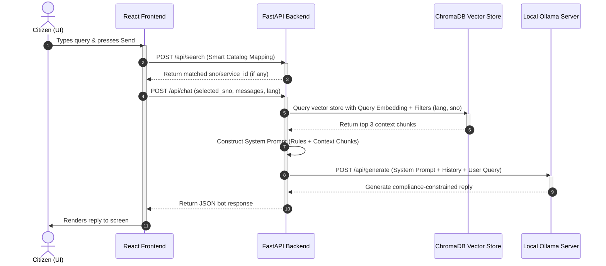

# SewaSetu RAG Knowledge Base and Query Processing Architecture

This document explains what is stored in the SewaSetu RAG vector database and outlines the end-to-end processing pipeline from user prompt to final LLM response.

---

## 1. What is Stored in the Vector Database?

The vector database uses **ChromaDB** to store and query dense vector representations of service documentation. The dataset contains two primary types of documents, split into chunks of **800 characters** with an overlap of **150 characters**:

### A. Service Metadata Chunks
* **Source:** Structured JSON profile profiles located under `scraped_data/profiles/service_<id>_<lang>.json`.
* **Transformation:** These JSON structures are transformed into clean, semantic Markdown using `convert_json_to_markdown()`. This ensures that field labels, application timelines, fees, and requirements are structured naturally for text embedding models and LLM attention heads.
* **Content Included:**
  - Service title, ID, department, and category.
  - SLA / timeline constraints.
  - Fees (online fees, kiosk fees, and raw fee text details).
  - Required document categories and their nested sub-document options (e.g., specific options for income proof).
  - Form field inputs required to complete the application online.

### B. Manual Chunks
* **Source:** Extracted text from PDF manuals and official guidelines located under `scraped_data/extracted_text/combined_manual_<id>_<lang>.txt`.
* **Content Included:** Step-by-step instructions, eligibility rules, guidelines for citizens, and administrative procedures.

### C. Chunk Metadata (Filtering Parameters)
Each document chunk written to ChromaDB contains the following payload metadata:
* `sno`: The serial number of the service (`"1"` to `"6"`).
* `service_id`: The database ID of the service (e.g., `"3"`).
* `language`: The language of the document (`"en"` or `"hi"`).
* `type`: The source type (`"metadata"` or `"manual"`).
* `name`: The name of the service.
* `department`: The hosting department name.

---

## 2. Process Flow: From Prompt Submission to Answer Generation

The diagram and steps below outline the path a user's prompt takes through the system:

### Detailed Execution Steps:

### Step 1: Query Submission
The citizen enters a prompt (e.g., *"required documents for income certificate"*) into the UI chat box.

### Step 2: Smart Catalog Mapping
* To prevent cross-service confusion, the frontend calls the `/api/search` endpoint.
* The backend parses the query against the catalog using a zero-temperature LLM prompt (with regex fallback) to identify if it maps to any of the 6 catalog services.
* If a match is found (e.g., mapping *"income certificate"* to service serial number `2`), the frontend updates the selected service state (`selectedSno`) dynamically.

### Step 3: API Chat Request
* The frontend makes a POST request to `/api/chat` with:
  - `messages`: Complete chat history including the latest prompt.
  - `selected_sno`: The current active/mapped service serial number.
  - `language`: The selected language interface (`"en"` or `"hi"`).

### Step 4: Context Retrieval (Strict Scoping)
* The query is converted into a dense vector embedding using `sentence-transformers/paraphrase-multilingual-MiniLM-L12-v2`.
* ChromaDB is queried with this embedding to retrieve the top **3** matching context chunks.
* **Strict Filter Scope:** To ensure maximum context accuracy, the search is scoped using ChromaDB's `$and` operator:
  - Chunks must match the requested `language`.
  - If a service is selected (`selected_sno`), the search is **strictly restricted** to chunks containing that specific `sno` metadata tag. This prevents documents from other services (such as Domicile Certificates) from bleeding into the context.

### Step 5: System Instructions & Context Assembly
* The backend aggregates the retrieved context chunks into a single text block.
* It wraps the context in strict instructions:
  - The model must answer **ONLY** using the provided context.
  - If the answer is not present in the context, it must reply with exactly `"Information not available."` (or `"जानकारी उपलब्ध नहीं है।"` in Hindi).
  - External pre-training knowledge or assumptions are completely disabled.

### Step 6: LLM Completion
* The constructed prompt is sent to the local Ollama instance running the `qwen2.5-coder:7b` model.
* The model evaluates the context under the system prompt constraints and generates the output.
* The API strips any thinking/reasoning tags and returns the final answer to the user interface.
